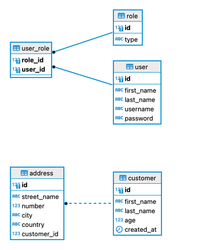

## Customers Manager

This is a API REST backend implementation for a Customers Manager.

## How to Run it

You can run it by calling the command below:

```
docker-compose  up --build
```

## Problem Description

Objective
Create a REST API application which allows users to manage their customers.
It should allow adding, updating, removing and fetching customers. Additionally users 
should be able to filter available customers based on one or more of the following criteria:
1. Find them by firstName and lastName
2. Find them by age
3. Text search within the instructions.
   For example, the API should be able to handle the following search requests:
   • Customers with age greater that 35 and live in Amstelveen
   • Customers without “Amstelveen” as an address (city field).

### Requirements
   Please ensure that we have some documentation about the architectural choices and also how to run the application. The project is expected to be delivered as a GitHub (or any other public git hosting) repository URL.
   All these requirements needs to be satisfied:
1. It must be a REST application implemented using Java 17 and Spring Boot framework
2. The code should be production-ready.
3. REST API must be documented
4. Data must be persisted in a database
5. Unit tests must be present
6. Integration tests must be present

### Description

- A User access the REST API directly (using Postman or Insomnia)
- A User can do queries on any given set of parameters, and using different kinds of filters and filtering fields (these searchable fields are called keys)
- A User can create, delete and update customers.
- In order to use the API, the User must be authenticated (JWT - JSON Web Tokens)

## How to do Searchs

You can use the endpoint /api/v1/customers/search, passing the HTTP Request body with the structure below:
```
{
"dataOption":"all",
   "searchCriteriaList":[
      {
      "key":"age",
      "filter":"gt",
      "value": 21
      },
      {
      "key":"address",
      "filter":"cn",
      "value":"Naeflaan"
      }
   ]
}
```
This query will return all customers with age greater than 21 and located at the address whose street name contains the word Naefflaan.

To just get a specific customer, you can just use the name as a query parameter using the EQ operator (equals):

```
{
"dataOption":"all",
   "searchCriteriaList":[
      {
      "key":"firstName",
      "filter":"eq",
      "value":"Julia"
      }
   ]
}
```
### Technical Solution

The solution is implemented in a layered structure (sometimes called hexagonal architecture), based on the MVC: `controllers` (where we implement REST API endpoints - 
they are the point of contact with the Users), `services` (which interfaces with the controllers on actions which implements high level requirements and coordinates 
actions among other services), repositories (which access the permanent storage).
The technologies used for the REST API were: Java 17, Spring Boot, Spring Framework, Spring Security, Spring Data JPA, Hibernate, PostgreSQL, etc.

The database used was PostgreSQL 14.6.

All of these were delivered using containers orchestraded with docker compose.

All the API is described using OpenAPI (Swagger). Once you start up the Backend container, you can access the API spec using the link: http://localhost:8080/swagger-ui/index.html

### Testing

I used some different approachs for testing - Unit Testing, Mock testing and a kind of Integration Testing (using testcontainers). 

To test the application, we use Maven:

```
mvn test
```
The test reports are generated as Surefire (https://maven.apache.org/surefire/maven-surefire-plugin/) and Jacoco (http://jacoco.org).

To generate the Jacoco reports you need to run the following:
```
mvn jacoco:report
```
To open the Jacoco reports, which are generated by the command above, go to: `$PATH/target/site/jacoco/index.html`

It is important to have tools like Jacoco or Sonar, to take care of the tests coverage and where to create more tests.

Example below (it is on 40% of code coverage):


It is possible to test it using Postman. There is an exported file with a Postman colletion to test the endpoints:

[example_customer_search.json](example_customer_search.json)

### Domain Model



### Getting Started

## How to run?

The application can be run in development or production mode by applying the following steps.
<br/>

### Prerequisites

The following apps should be installed before running the application:

- A command line app
- Docker Desktop

> **Note** <br/>
> For more information regarding the system requirements, etc. refer to the following pages: <br/>
> [Install on Mac](https://docs.docker.com/desktop/install/mac-install/)<br/>
> [Install on Windows](https://docs.docker.com/desktop/install/windows-install/)<br/>
> [Install on Linux](https://docs.docker.com/desktop/install/linux-install/)<br/>

<br/>

### Running the app - Customers Management API backend

In order to run the application in development mode, apply the following steps:

1. Run Docker desktop.

<br/>

2. Open command prompt window and clone the project from GitHub using the following command:

```
git clone https://gitlab.com/rosfran/customers-api.git
```
<br/>

3. Change the current directory to the project directory where the `docker-compose.yml` file is in:

```
cd customers-api
```
<br/>

4. Run the following command:

You can use:

```
docker-compose  up --build
```
Or in some Docker installations:
```
docker compose  up --build
```


### User Account
```
username: jake
password: jake2d
role: admin

username: johndoe
password: johnd@e
role: admin

```

<br/>

<br/>

When you run the docker-compose command above the backen and database containers are built and start up. 

Alternatively, API requests can be sent to the endpoints using Postman, etc. 
<br/>

For connecting to the application database, the following url and credentials given in the `.env` file can be used.

```
url: jdbc:postgresql://localhost:5432/<${DB_NAME}>
```

<br/>

## How to test?

### Open API (Swagger) UI

The API specs are generated based on the Annotations used in the classes (Controller layer).
To see the Open API (Swagger) Documentation UI, visit http://localhost:8080/swagger-ui/index.html after running the app.

<br/>

### Running Unit, Mock and Integration Tests

You can type:
```
mvn test:test
```
<br/>

### Postman Collection

<br/>

### API Endpoints

Please see the Swagget API documentation: http://localhost:8080/swagger-ui/index.html

> **Note** <br/>
> All URIs are relative to *http://localhost:8080/api/v1*

<br/>

All an be found on the Swagger Reference above.
<br/>

### Unit & Integration Tests
Unit and Integration Tests are provided for services and controllers in the corresponding packages.

<br/>
<br/>

### Troubleshooting

### Documentation

[docker compose up](https://docs.docker.com/engine/reference/commandline/compose_up/)<br/>

<br/>
<br/>
<br/>

### Dependencies

* Java 17
* Spring Boot
* Spring Web
* Spring Security
* Spring Data JPA
* Lombok
* MapStruct
* PostgreSQL
* Flyway

<br/>

### Documentation
[Spring Boot](https://docs.spring.io/spring-boot/docs/current/reference/htmlsingle/)<br/>
[Spring Security](https://docs.spring.io/spring-security/reference/index.html)<br/>
[Spring Data JPA](https://docs.spring.io/spring-data/jpa/docs/current/reference/html/)<br/>
[springdoc-openapi v2](https://springdoc.org/v2/)<br/>
[MapStruct](https://mapstruct.org/)<br/>
[JUnit 5](https://junit.org/junit5/docs/snapshot/user-guide/)<br/>


### Version History

* v1.0.0 Initial Release

